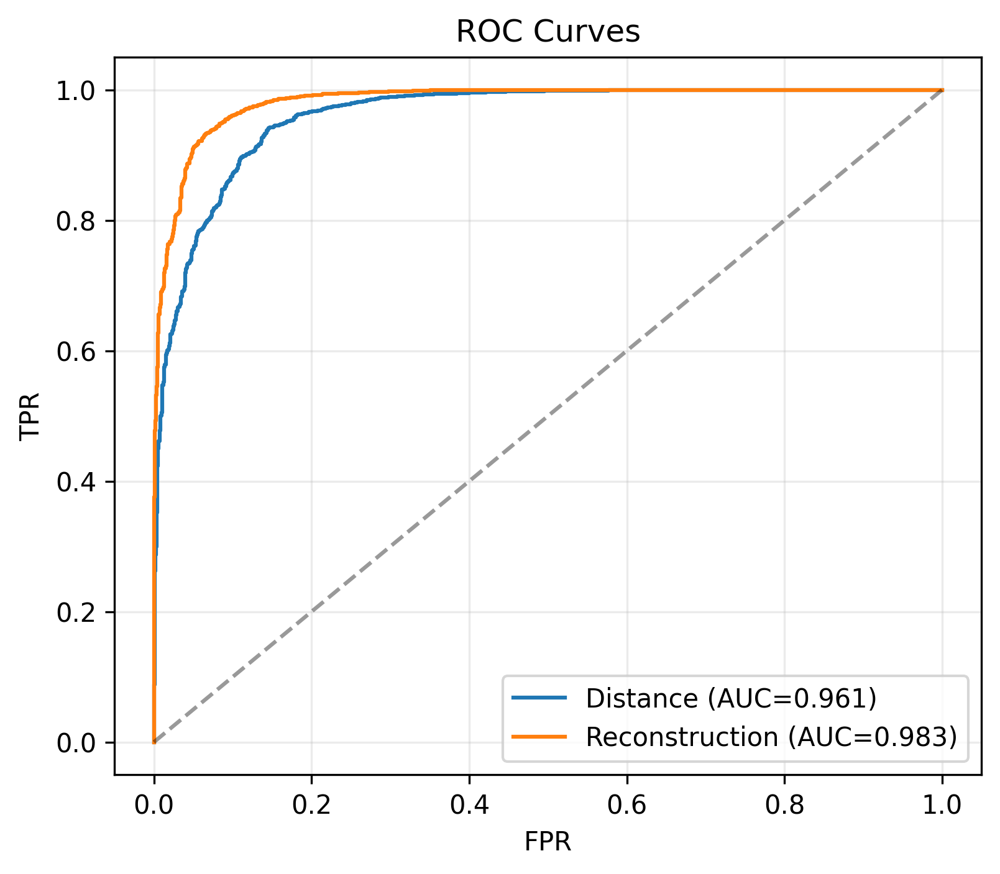
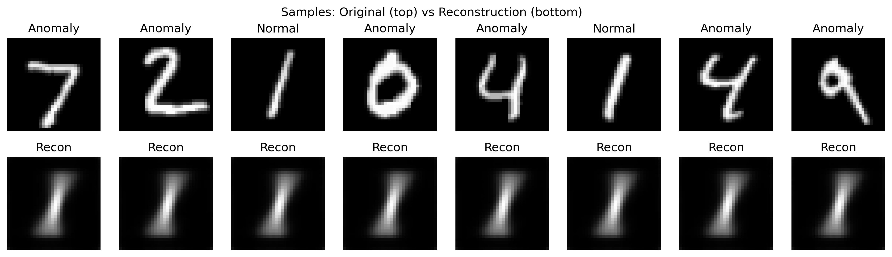

# DSPSVDD — Deep Structure-Preserving SVDD for One-Class Anomaly Detection

**Author:** Hamza Oukhacha   & OUDRAIA Abdelouahad
**Dataset:** MNIST / Fashion-MNIST  
**Normal Class:** any digit `k` (0..9)

---

## 📌 Project Overview
This project implements **Deep Structure-Preserving SVDD (DSPSVDD)** for one-class anomaly detection.  
It extends the classic **SVDD** and **Deep SVDD** approaches by combining:
- A **Convolutional AutoEncoder** (to preserve data structure via reconstruction).
- An **SVDD objective** (to minimize distance of normal samples to a hypersphere center).

The result is a stable training pipeline that achieves strong anomaly detection performance on MNIST and Fashion-MNIST.

---

## Features
- **Training pipeline**: AE pretraining → compute center → joint DSPSVDD training.
- **Evaluation metrics**:
  - ROC-AUC, PR-AUC, FPR@95%TPR, Accuracy, F1, MCC
- **Figures generated**:
  - ROC curves
  - Precision–Recall curves
  - Training loss curves
  - Confusion matrix
  - Sample reconstructions (original vs reconstruction)
- **Multi-class support**:
  - Run experiments for all MNIST digits (1→9) automatically.
- **Results export**:
  - JSON with metrics and config
  - CSV training history
  - Model checkpoint (`.pth`)
  - Aggregated CSV summary across all runs

---
## Requirements
- Python 3.8+
- PyTorch >= 1.12
- torchvision
- scikit-learn
- matplotlib
- pandas

---
## Getting Started

### 1. Open in Google Colab
Upload the notebook [`DSPSVDD_Final.ipynb`](./DSPSVDD_project_Net.ipynb) to [Google Colab](https://colab.research.google.com/).

## Example Results
 # For Class 1 (nc_1)
 # For Class 1 (nc_1)

## Authors
- Hamza Oukhacha (Master IAA, Morocco)
- Contact: [LinkedIn](https://www.linkedin.com/in/hamza-oukhacha/)
- OUDRAIA Abdelouahad (Master IAA, Morocco)
- Contact: [LinkedIn](https://www.linkedin.com/me?trk=p_mwlite_feed-secondary_nav/)

### 2. Mount Google Drive (recommended)
```python
from google.colab import drive
drive.mount('/content/drive')
